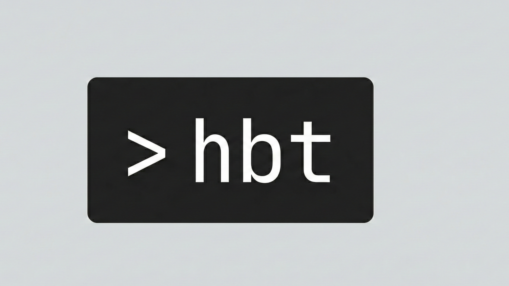

<p align="center">
  
</p>

<p align="center">
  <a href="https://github.com/vittolewerissa/hbt/stargazers"></a>
  <a href="https://github.com/vittolewerissa/hbt/releases"></a>
  <a href="LICENSE"></a>
  <a href="https://github.com/vittolewerissa/hbt/commits"></a>
  <a href="https://twitter.com/vittolewerissa"></a>
</p>

<p align="center">
  A minimalist, local-first TUI for tracking daily habits. Built with Go and <a href="https://github.com/charmbracelet/bubbletea">Bubble Tea</a>.
</p>

## Features

- **Local-first**: All data stored locally in SQLite
- **Flexible scheduling**: Daily, weekly, or X times per week
- **Streak tracking**: Monitor your consistency with automatic streak calculation
- **Categories**: Organize habits with color-coded categories
- **Stats panel**: Always-visible statistics sidebar with completion rates and sparklines
- **Keyboard-driven**: Vim-style navigation (j/k) and intuitive shortcuts

## Installation

### Using Go (Recommended)

```bash
go install github.com/vittolewerissa/hbt/cmd/hbt@latest
```

Then run:
```bash
hbt
```

### From Source

```bash
git clone https://github.com/vittolewerissa/hbt.git
cd hbt
go build -o hbt ./cmd/hbt
./hbt
```

## Usage

### Navigation

| Key | Action |
|-----|--------|
| `j` / `k` | Move down / up |
| `Tab` | Next tab |
| `Shift+Tab` | Previous tab |
| `q` | Quit |

### Today Tab

| Key | Action |
|-----|--------|
| `Space` / `Enter` | Toggle habit completion |

### Habits Tab

| Key | Action |
|-----|--------|
| `a` | Add new habit |
| `e` | Edit selected habit |
| `d` | Delete selected habit |

## Data Storage

Data is stored in `~/.habit-cli/habits.db` (SQLite database).

## Tech Stack

- [Go](https://go.dev/)
- [Bubble Tea](https://github.com/charmbracelet/bubbletea) - TUI framework
- [Lip Gloss](https://github.com/charmbracelet/lipgloss) - Styling
- [Bubbles](https://github.com/charmbracelet/bubbles) - TUI components
- [modernc.org/sqlite](https://pkg.go.dev/modernc.org/sqlite) - Pure Go SQLite

## License

MIT
